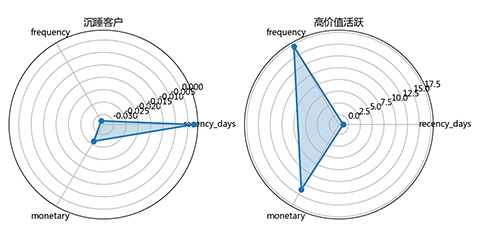

# Customer Segmentation and Product Association Analysis for Baseball Gear E-commerce

E-commerce customer segmentation and product association analysis using SQL and Python on baseball equipment order data (from Alibaba Tianchi).
Applied RFM, K-Means clustering, and Apriori algorithm. 
Identified 0.19% high-value customers and 5 product communities, informing business strategy optimization. 
 🇨🇳 中文说明指南：请您在上方仓库中点击README_CN.md，以阅读中文说明。 
  Radar chart of RFM features by cluster : 
   
## 1. Project Background

This is my first personal project for job hunting. My initial goal was to demonstrate to local HR that I have mastered SQL and Python data analysis tools and possess a certain level of business intuition.

As a newcomer to the data analytics field, I also hope that global peers who see this project can offer their insights, so I have additionally created English versions of the README and the analysis report.

Unlike some data analysis/machine learning projects that simply focus on mining data, this project goes a step further. I put myself in the shoes of the head of the data department at a real company, analyzing problems from the perspective of simulating e-commerce operations, and striving to design business strategies based on real-world characteristics.

## 2. File Structure

|Content|Folder|Details|
|---|---|---|
|Data|`database`|`raw`: raw data;   `retail_analysis`: database generated by SQL scripts;   `sqlexport`: data exported by SQL scripts;   `pyexport`: data exported by Python scripts|
|SQL Code|`notebook/sql`|`01_db_setup.sql`: data import script, creates database from raw data;   `02_db_preprocess.sql`: preliminary statistics using database, generates views for Python|
|Python Code|`notebook/python`|`01_exploratory_analysis.py`: aggregates data using SQL views, conducts preliminary analysis and visualization of common business metrics;   `02_ml_modeling.py`: customer segmentation and product association analysis, generates business recommendations|
|Reports|`report`|`photos`: all charts output from scripts;   `report_cn.pdf`: Chinese analysis report;   `report_en.pdf`: English analysis report (chart legends are in Chinese)|
|Environment Info|repository root|`requirements.txt`: python environment info;   `extensions.json`: recommended VSCode extensions|
|Documentation|repository root|`README.md`: English description;   `README_CN.md`: Chinese description;   `dinfo.md`: data dictionary|

## 3. How to Run

This project consists of two parts: SQL and Python. The analysis report was generated in multiple stages, so the scripts depend on each other; subsequent scripts rely on the output of previous ones.

**Recommended execution order of scripts:**  
`01_db_setup.sql` → `02_db_preprocess.sql` → `01_exploratory_analysis.py` → `02_ml_modeling.py`

All scripts use local directories on my personal computer. If you download the data to your own local data directory, please manually adjust the input/output directory settings in the scripts to read files correctly.

**Main tools and versions:**

- MySQL 8.4
    
- MySQL Workbench 8.0.46（For SQL）
    
- Python 3.14
    
- Visual Studio Code 1.11（Mainly For Python）
    

## 4. Data Description

The original data comes from a competition on the Alibaba Algorithm Community. I obtained data authorization by registering for this competition and have submitted my results to the competition organizers.

**Competition link:** https://tianchi.aliyun.com/competition/entrance/531891

**Original data link:** https://tianchi.aliyun.com/dataset/97652

Although the competition topic is product association analysis, I intended to conduct additional in-depth exploration. As a student not yet employed, it is difficult for me to access real business data. The data from this competition perfectly meets my needs – it originates from real business scenarios, has rich variables, and comes with a clear business context.

The original data is divided into four tables:

- `order.csv` (sales details)
    
- `product.csv` (product information)
    
- `date.csv` (date information)
    
- `customer.csv` (customer ID table)
    

The data in this repository has undergone formatting adjustments because the original data provided by the competition organizers was not in standard delimiter-separated CSV format – it contained many `"` wrapping each line, which prevented MySQL from reading it correctly. If you obtain the data from the competition instead of this repository, please pay attention to the data format.

## 5. Analysis Methodology

The ultimate goal of this project is to solve business problems through machine learning.

The focus of the first three scripts is data preprocessing, descriptive statistics, and exploratory analysis, helping us understand data characteristics and prepare for machine learning. In these parts, I used data aggregation and common descriptive statistical methods, calculating most basic e-commerce business metrics.

The focus of the machine learning script is customer segmentation and product association analysis using the prepared data. In this part, I used **RFM + K-Means clustering** for customer evaluation and segmentation, applied the **Apriori algorithm** to construct a basket matrix, and used the **Louvain algorithm** to build a product community network.

## 6. Key Findings

1. **High-value customers account for 0.19%**, while dormant customers make up 99.81%. However, due to the low-repurchase nature of the products, the current e-commerce model should be considered a **loyalty-based model**, and there is no urgent need to acquire new customers.

|Cluster|Size (%)|Avg Recency (days)|Avg Frequency|Avg Monetary (¥)|
|--------|----------|------|--------|--------|
|Dormant Customers|99.81%|190.66|1.46|2023.02|
|High Value Active|0.19%|18.51|19.77|40743.81|

3. The top product combinations (*541-baseball glove → 530-baseball glove*; *540-baseball glove → 529-baseball glove*) have a **lift of 16.05**, strongly suggesting bundling opportunities.
   
|ante_ids_names|conseq_ids_names|support|confidence|lift|
|--------|----------|------|--------|--------|
|[530-棒球手套]|[541-棒球手套]|0.029256|0.543376|16.050221|
|[541-棒球手套]|[530-棒球手套]|0.029256|0.864171|16.050221|
|[540-棒球手套]|[529-棒球手套]|0.021544|0.695093|8.086391|
|[539-棒球手套]|[529-棒球手套]|0.021942|0.654428|7.613304|

## 7. Business Recommendations

Based on the data analysis, we propose **five categories of actionable business recommendations**:

1. **High-Value Customer Retention:** Provide bulk purchase discounts and VIP services to facilitate core customers and increase user stickiness.
    
2. **Dormant Customer Reactivation:** Use email campaigns, content marketing, and after-sales events to awaken customer demand.
    
3. **New Bundled Packages:** Launch two new product bundles based on association analysis.
    
4. **Algorithmic Cross-Selling:** Display "frequently bought together" recommendations to users during browsing.
    
5. **Online Shelf Optimization:** Place related products close together on the page (e.g., the two bat & bag products 478 and 477).
    

## 8. Copyright Information

The copyright of the original data belongs to Alibaba Group (China). This project uses the data solely for learning and communication purposes, with authorization, and not for any commercial purpose. After downloading the original data, please delete it within 24 hours.

The code files, their outputs, and the analysis reports are owned by the author, Alex Wang (@Alex-Wang10125). No one can use them for commercial purposes.
