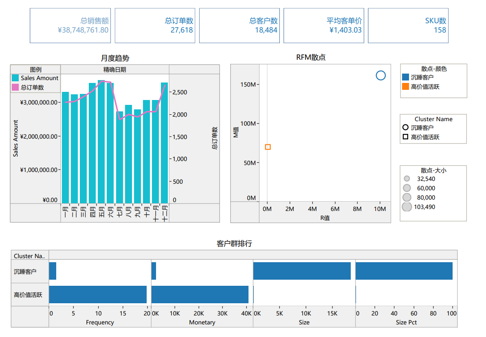

# RFM & Association Rules — A Sports Retail Case Study

A Python-based sports retail customer analytics project covering **RFM customer segmentation, K-Means clustering, and Apriori association rule mining**, with a Tableau sales overview dashboard.

## Environment

| Component | Version/Config |
|---|---|
| Python | 3.x |
| MySQL | 8.x (source data import) |
| Tableau Desktop | 2026.1.2 |
| Data Size | ~570K basket rows, ~18K customers |

## Project Structure

```
.
├── database/
│   ├── sqlexport/                # MySQL exported CSVs
│   │   ├── v_basket_detail.csv       # Basket transactions (~570K rows)
│   │   └── v_customer_features.csv   # Customer RFM features (~18K rows)
│   └── pyexport/                 # Python analysis exports
│       ├── ml_customer_with_cluster.csv  # K-Means clustering results
│       └── ml_cluster_profile.csv       # Cluster profile summary
├── notebooks/                    # Jupyter Notebooks
├── report/                       # Analysis reports
├── BI/                           # Tableau Dashboard
│   ├── 260612_DA_BI.twb          # Tableau workbook
│   ├── 260612_DA_BI.pdf          # Dashboard export
│   └── DA_BI.png                 # Dashboard screenshot
├── readme_cn.md                  # Chinese README
├── readme_en.md                  # This file
└── requirements.md               # Analysis requirements
```

## Three Analysis Modules

| # | Module | Method | Key Results |
|---|---|---|---|
| 1 | **RFM Segmentation** | Recency / Frequency / Monetary scoring | Customer value tiers, high-value vs churn-risk identification |
| 2 | **K-Means Clustering** | Standardized RFM → K-Means → Cluster profiling | 2 clusters (High-Value Active / Dormant), with size_pct |
| 3 | **Association Rules** | Apriori → Support / Confidence / Lift | Basket item associations for cross-sell strategy |

## BI Dashboard

A **Tableau Sales Overview & Customer Analytics Dashboard** (1 page) built on this project's data, covering KPI overview, monthly sales trends, RFM scatter plot, and customer segment comparison — 4 component groups in total.



> Workbook: [BI/260612_DA_BI.twb](BI/260612_DA_BI.twb)

### Dashboard Components

| Component | Type | Description |
|------|------|------|
| KPI Cards Row | Text cards | Total Sales, Total Orders, Total Customers, Avg Transaction, SKU Count |
| Monthly Trend | Dual-axis combo (bar + line) | Bar = Sales, Line = Order count, by month |
| RFM Scatter | Scatter plot | X=Recency, Y=Monetary, Color=Cluster, Size=Frequency |
| Segment Comparison | Bar chart | Dormant vs High-Value, side-by-side metric comparison |

## Quick Start

### 1. Import Data to MySQL

```bash
mysql -u root < database/create_views.sql
```

### 2. Run Python Analysis

```bash
pip install -r requirements.txt
jupyter notebook notebooks/
```

### 3. Open Tableau Dashboard

Tableau Desktop → Open → `BI/260612_DA_BI.twb`

## License

MIT
